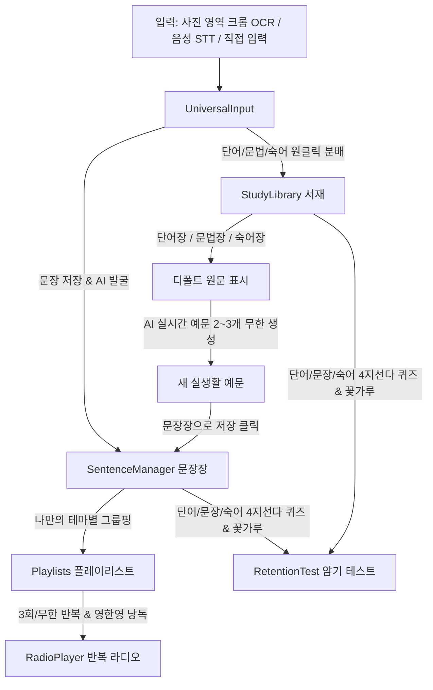

# 📋 All4UEnglish 프로젝트 인수인계 및 현황 보고서 (Handover Guide)

> **최종 갱신 일시**: 2026-09-12 22:52  
> **진행 상태**: 요구사항 2차 고도화(문장 중심 입력 $\rightarrow$ 단어/문법/숙어 파생 및 동적 예문 생성 $\rightarrow$ 플레이리스트 반복 청취 $\rightarrow$ 암기 테스트) 전체 구현 및 빌드 검증 완료  
> **핵심 철학**: 안드레 카파시의 *Zero-Bloat*, *Deterministic Closed-Loop*, *Micro-Milestones* 준수

---

## 1. 최신 아키텍처 개요 (5대 핵심 모듈)



---

## 2. 5대 핵심 기능 및 화면 구성

| 모듈명 | 컴포넌트 경로 | 주요 기능 |
| :--- | :--- | :--- |
| **`UniversalInput`** | `src/blocks/UniversalInput/` | 책/화면 사진 속 문장 영역 드래그 크롭(Vision OCR), 실시간 음성 STT, 직접 타이핑 $\rightarrow$ 문장 등록 및 AI 추천(단어/문법/숙어) 원클릭 전송 |
| **`SentenceManager`** | `src/blocks/SentenceManager/` | 입력된 문장 및 파생 예문 영구 보관, 태그/출처/북마크, 나만의 플레이리스트 생성 및 문장 그룹핑, 원터치 라디오 청취 연동 |
| **`StudyLibrary`** | `src/blocks/StudyLibrary/` | 단어장 / 문법장 / 숙어장 3단 세그먼트 뷰, 원래 입력했던 문장(디폴트 예시) 보존, **[AI 새 예문 2~3개 생성 ✨]** 및 맘에 드는 예문 **[문장장으로 저장 📥]** |
| **`RadioPlayer`** | `src/blocks/RadioPlayer/` | 플레이리스트 선택, [3회 반복 / 무한 루프], [영 $\rightarrow$ 한 번역 $\rightarrow$ 영 / 영어만], [0.8x / 1.0x / 1.2x] 설정 가능한 백그라운드 오디오 플레이어 |
| **`RetentionTest`** | `src/blocks/RetentionTest/` | 단어 / 문장 / 숙어 카테고리별 4지선다 암기 테스트, 즉각 음성 피드백 & 점수 집계 & 컨페티 꽃가루 리워드 |

---

## 3. 실행 방법

```bash
# 개발 서버 가동
npm run dev

# 프로덕션 빌드 검증 (2.1초 완료, 0개 에러)
npm run build
```

* **PC 브라우저**: [http://localhost:5173/](http://localhost:5173/)
* **갤럭시 스마트폰 (동일 Wi-Fi)**: [http://192.168.0.11:5173/](http://192.168.0.11:5173/)
* **레고 블록 플레이그라운드**: [http://localhost:5173/?block=AuthGate](http://localhost:5173/?block=AuthGate)
