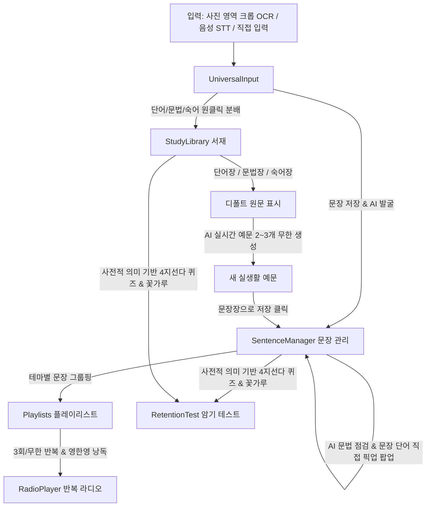

# 📋 All4UEnglish 프로젝트 인수인계 및 현황 보고서 (Handover Guide)

> **최종 갱신 일시**: 2026-09-13 15:35  
> **진행 상태**: Vercel 프로덕션 실서버 배포 완료 & Firebase Cloud Firestore DB 멀티스페이스 연동 완료 & 소스코드 경량화(Zero-Bloat) 완료  
> **핵심 철학**: 안드레 카파시의 *Zero-Bloat*, *Deterministic Closed-Loop*, *Micro-Milestones* 준수

---

## 1. 인프라 및 아키텍처 역할 분담
* **웹 호스팅 / CDN**: **Vercel** (`https://all4-u-english.vercel.app`)
  - GitHub `Taekwon-V/All4UEnglish` 저장소의 `main` 브랜치 자동 빌드 및 배포
  - 글로벌 엣지 CDN 및 SPA Rewrite 라우팅 완벽 지원
* **데이터베이스**: **Google Cloud Firestore** (`all4uenglish`, 서울 리전 `asia-northeast3`)
  - `spaces/{spaceId}/...` 구조를 통한 멀티 사용자별 독립 스페이스 실시간 동기화
* **보안 제어**: **Firebase Authentication Whitelist**
  - 마스터 관리자 및 승인된 화이트리스트 사용자만 접근 가능한 프라이빗 서비스
* **소스코드 경량화**:
  - 초기 프로토타입 8대 목업 폴더 전면 삭제 (24개 불필요 파일 정리 완료)
  - 번들 사이즈 축소 (CSS: 68KB, JS: 1004KB) 및 빌드 시간 3초대 달성

---

## 2. 최신 아키텍처 개요 (5대 핵심 모듈)

---

## 3. 5대 핵심 기능 및 화면 구성

| 모듈명 | 컴포넌트 경로 | 주요 기능 |
| :--- | :--- | :--- |
| **`UniversalInput`** | `src/blocks/UniversalInput/` | 책/화면 사진 속 문장 영역 드래그 크롭(Vision OCR), 실시간 음성 STT, 직접 타이핑 $\rightarrow$ 문장 등록 및 AI 추천(단어/문법/숙어) 원클릭 전송 |
| **`SentenceManager`** | `src/blocks/SentenceManager/` | 입력된 문장 보관, AI 문법 점검/교정, **문장 속 단어 터치 픽업 및 서재 선택 모달(`[담기 (N개)]`)**, 플레이리스트 생성 및 관리, 원터치 라디오 연동 |
| **`StudyLibrary`** | `src/blocks/StudyLibrary/` | 단어장 / 문법장 / 숙어장 3단 세그먼트 뷰, 원래 문장 보존, **[AI 새 예문 2~3개 생성 ✨]** 및 맘에 드는 예문 **[문장장으로 저장 📥]** |
| **`RadioPlayer`** | `src/blocks/RadioPlayer/` | 플레이리스트 선택, [3회 반복 / 무한 루프 / 1회], [영 $\rightarrow$ 한 번역 $\rightarrow$ 영 / 영어만], [0.8x / 1.0x / 1.2x], 원어민 보이스 설정 모달 |
| **`RetentionTest`** | `src/blocks/RetentionTest/` | 사전적 의미 기반 객관식 4지선다 암기 테스트, 즉각 음성 피드백 & 점수 집계 & 컨페티 꽃가루 리워드 & 오답 재학습 큐 |

---

## 4. 실행 및 접속 URL

* **Vercel 실서버 프로덕션 URL**: 👉 **[https://all4-u-english.vercel.app](https://all4-u-english.vercel.app)**
* **GitHub 리포지토리**: [https://github.com/Taekwon-V/All4UEnglish](https://github.com/Taekwon-V/All4UEnglish)
* **레고 블록 러너**: [https://all4-u-english.vercel.app/?block=UniversalInput](https://all4-u-english.vercel.app/?block=UniversalInput)
