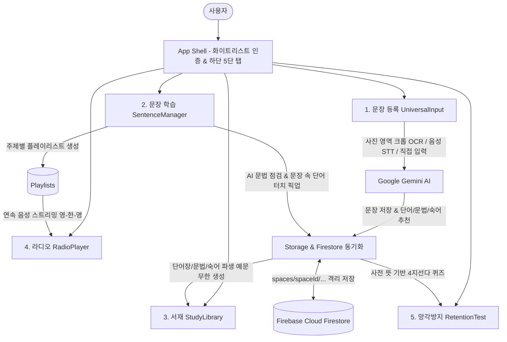

# 📖 All4UEnglish 시스템 요구사항 및 기능 상세 명세서 (PRD & Specification)

* **프로젝트명**: All4UEnglish (All for You English)
* **타겟 사용자**: 아내 1인 맞춤형 프라이빗 영어 학습 웹 애플리케이션
* **최적화 기기**: 모바일 퍼스트 (삼성 갤럭시 S26 / 19.5:9 롱스크린 최적화, One-Hand UX, PWA 지원)
* **핵심 인프라**: React 18 + Vite + Google Gemini API + Firebase (Google Auth Whitelist & Cloud Firestore) + Web Speech API + Vercel

---

## 1. 프로젝트 철학 및 기본 원칙 (Karpathy First Principles)

1. **First Principles & 극단적 단순성 (Zero-Bloat)**:
   * 아내가 공부한 영어 문장을 소리 내어 읽거나 사진을 찍으면 즉시 단어, 문법, 회화 예문, 플레이리스트, 망각방지 퀴즈로 전환해 주는 본질에 집중한다.
   * 불필요한 서드파티 라이브러리나 과도한 추상화를 배제하고, 동작 원리를 투명하게 제어할 수 있는 최소한의 직관적인 코드로 작성한다.
2. **Deterministic Closed-Loop (닫힌 피드백 평가 루프)**:
   * 문장 입력부터 AI 분석, 서재 저장, 연속 오디오 스트리밍, 퀴즈 피드백까지 모든 상태 전이가 단절 없이 즉각적으로 피드백된다.
3. **Micro-Milestones (작은 단위 점진적 빌드)**:
   * 각각의 핵심 기능을 독립적으로 검증한 후 메인 앱 셸에 유기적으로 결합한다.

---

## 2. 시스템 아키텍처 및 데이터 흐름



---

## 3. 5대 핵심 모듈 기능 상세 명세

### 3.1 모듈 1: 스마트 문장 등록 (`UniversalInput`)
* **카메라 / 이미지 영역 크롭 OCR (`CropCanvas`)**:
  - 교재나 화면 캡처 사진을 업로드하고 원하는 문장 영역만 드래그하여 크롭.
  - Gemini Vision API를 통해 영어 원문과 매끄러운 구어체 한국어 번역을 1초 만에 추출.
* **실시간 음성 인식 STT (Web Speech API)**:
  - 마이크 버튼을 누르고 영어를 발화하면 실시간 음성 인식 및 파형 표시.
* **직접 텍스트 입력 및 자동 번역**:
  - 영어 문장을 직접 타이핑하면 번역 및 핵심 어휘 자동 분석.
* **AI 원클릭 서재 전송**:
  - 문장 등록과 동시에 핵심 단어, 문법 패턴, 관용구를 즉시 서재(단어장/문법/숙어)로 자동 연계.

---

### 3.2 모듈 2: 문장 학습 및 플레이리스트 관리 (`SentenceManager`)
* **3단 세그먼트 네비게이션**:
  - `학습 중 (learning)` / `학습 완료 (mastered)` / `플레이리스트 (playlists)` 세그먼트 전환.
* **원터치 액션 바**:
  - `[✓ 학습완료/다시학습]` | `[✏️ 문장 수정]` | `[Playlist +]` | `[🗑️ 삭제]`
  - 모바일 한 손 조작에 최적화된 1줄 버튼 레이아웃.
* **AI 문장 문법 & 원어민 표현 정밀 점검**:
  - 오타, 시제 오류, 콩글리시 어색함을 자동 감지.
  - 교정된 추천 문장 및 따뜻한 1줄 교정 이유 제공, 원클릭으로 수정 사항 반영.
* **서재 학습 자산 선택 추가 팝업 (`assetSelectionModal`)**:
  - **문장 속 단어 직접 터치 픽업**: 문장 속 모든 단어가 개별 칩 버튼(`[+ There]`, `[+ is]`, `[+ nothing]` 등)으로 렌더링되어 터치 1번으로 단어장에 즉시 추가.
  - **실시간 사전 조회**: 단어 추가 시 Gemini 사전 엔진을 통해 품사, 발음기호, 정확한 한국어 대표 사전 뜻을 비동기 조회하여 보강.
  - **선택형 저장**: 불필요한 단어/문법/숙어는 체크 해제하거나 `[✕]`로 제거하고, 원하는 항목만 `[담기 (N개)]` 버튼으로 깔끔하게 서재에 반영.
  - **화면 중앙 정렬 모달**: 화면 하단 탭바에 가려지지 않는 `min(85dvh, 620px)` 중앙 정렬 팝업.
* **테마별 플레이리스트 시스템**:
  - 주제(태그)별 문장 묶음 또는 자유로운 이름으로 플레이리스트 생성.
  - 생성 모달 내 불필요한 예시 문구 없이 사용자 정의 이름/설명 입력 지원.
  - 문장 카드에서 `[Playlist +]`를 눌러 여러 플레이리스트에 즉시 추가/제외.

---

### 3.3 모듈 3: 서재 (`StudyLibrary`)
* **3대 학습 자산 탭**:
  - 📖 **단어장 (Vocabulary)**: 단어, 발음기호, 품사 배지, 대표 한국어 뜻, 실전 활용 뉘앙스.
  - 📐 **문법 (Grammar)**: 문법 핵심 공식, 패턴 태그, 해설.
  - 💡 **숙어 (Idioms)**: 관용구 및 일상 표현 뜻.
* **디폴트 원문 예시 보존**:
  - 해당 단어/문법/숙어가 처음 추출되었던 원래 문장이 기본 예문으로 자동 연결 보존.
* **AI 실생활 파생 예문 무한 생성 (`generateVariations`)**:
  - 버튼을 누를 때마다 일상 대화에서 원어민이 실제 쓰는 새로운 예문 2~3개를 실시간 동적 생성.
  - 마음에 드는 예문은 `[문장장으로 저장]`을 눌러 메인 문장 학습 목록으로 즉시 영구 저장.

---

### 3.4 모듈 4: 연속 청취 라디오 플레이어 (`RadioPlayer`)
* **백그라운드 연속 오디오 스트리밍**:
  - 산책, 출퇴근, 집안일 중 화면을 켜두지 않아도 귀로 반복 학습하는 오디오 환경.
* **재생 루프 모드**:
  - `3회 반복 (3 times)`: 문장마다 3회 연속 낭독 후 다음 문장으로 이동.
  - `무한 반복 (infinite)`: 현재 선택된 문장을 무한히 반복 낭독.
  - `1회 재생 (once)`: 1회씩 전체 재생 목록 완주.
* **낭독 모드 & 배속 설정**:
  - `영-한-영 (en-ko-en)`: 영어 낭독 $\rightarrow$ 한국어 해석 낭독 $\rightarrow$ 영어 재낭독.
  - `영어만 (en-only)`: 원어민 영어 발음만 연속 재생.
  - `0.8x / 1.0x / 1.2x` 재생 배속 조절.
* **원어민 음성 설정 (`SpeechService`)**:
  - 기기 내장 Web Speech 시스템 음성 및 원어민 프리셋(US/UK/AU) 선택 지원.
  - 음조(Pitch) 및 발음 속도(Rate) 세부 튜닝 모달 제공.

---

### 3.5 모듈 5: 망각방지 퀴즈 (`RetentionTest`)
* **에빙하우스 망각곡선 기반 4지선다 퀴즈**:
  - 등록된 단어들을 기반으로 실시간 객관식 문제 자동 생성.
* **사전적 의미 엄격 분리**:
  - 장황한 문맥 뉘앙스 서술형 문구를 배제하고, 한국어 대표 사전 뜻만을 정답 및 오답 보기로 사용하여 논리적이고 깔끔한 퀴즈 출제.
* **즉각적인 음성 & 시각 피드백**:
  - 정답 시 원어민 발음 낭독 + 컨페티(꽃가루) 애니메이션 리워드.
  - 오답 시 즉시 복습 큐에 등록하여 정답을 맞힐 때까지 재출제.

---

## 4. 데이터베이스 스키마 및 보안 규격

### 4.1 데이터 모델 (Firestore Collections)

```typescript
// 1. 문장 (spaces/{spaceId}/sentences/{id})
interface SentenceItem {
  id: string;
  text: string;
  translation: string;
  tags: string[];          // e.g. ["BIU", "카페", "여행"]
  source?: string;
  status: 'learning' | 'mastered';
  isBookmarked: boolean;
  reviewCount: number;
  createdAt: string;
  updatedAt?: string;
}

// 2. 단어 (spaces/{spaceId}/words/{id})
interface WordItem {
  id: string;
  word: string;
  phonetic?: string;
  partOfSpeech?: string;   // e.g. "명사", "동사"
  dictionaryMeanings: string[]; // e.g. ["바쁜", "분주한"]
  nuanceKo?: string;
  originalSentence?: string;
  sentenceId?: string;
  variations?: Array<{ en: string; ko: string }>;
  status: 'learning' | 'mastered';
  isBookmarked: boolean;
  reviewCount: number;
  createdAt: string;
}

// 3. 문법 (spaces/{spaceId}/grammar/{id})
interface GrammarItem {
  id: string;
  pattern: string;
  tag: string;             // e.g. "#존재", "#조동사"
  explanation: string;
  originalSentence?: string;
  sentenceId?: string;
  variations?: Array<{ en: string; ko: string }>;
  status: 'learning' | 'mastered';
  isBookmarked: boolean;
  createdAt: string;
}

// 4. 숙어 (spaces/{spaceId}/idioms/{id})
interface IdiomItem {
  id: string;
  idiom: string;
  meaning: string;
  originalSentence?: string;
  sentenceId?: string;
  variations?: Array<{ en: string; ko: string }>;
  status: 'learning' | 'mastered';
  isBookmarked: boolean;
  createdAt: string;
}

// 5. 플레이리스트 (spaces/{spaceId}/playlists/{id})
interface PlaylistItem {
  id: string;
  title: string;
  description?: string;
  sentenceIds: string[];
  createdAt: string;
}
```

### 4.2 사용자 공간 격리 및 보안
* **멀티 사용자 스페이스 격리 (`WorkspaceService`)**:
  - 로그인한 계정의 이메일 해시 기반 `currentSpaceId` 생성.
  - 모든 Firestore 데이터가 `spaces/{spaceId}/...` 하위로 완벽 격리되어 개인별 학습 기록이 절대 섞이지 않음.
* **화이트리스트 인증 제어 (`WhitelistService`)**:
  - 마스터 관리자 이메일(`mybest1725@gmail.com`) 및 승인된 화이트리스트 사용자만 접근 가능.
  - 비인가 사용자는 로그인 시 자동으로 진입 차단 안내 모달 표시.

---

## 5. 배포 및 인프라 운영 환경

* **호스팅 & CDN**: Vercel 프로덕션 자동 배포 (`https://all4-u-english.vercel.app`)
* **저장소**: GitHub (`Taekwon-V/All4UEnglish`, branch: `main`)
* **클라우드 데이터베이스**: Firebase Cloud Firestore (서울 리전 `asia-northeast3`)
* **AI 엔진**: Google Gemini 2.5 / Flash API
* **오디오 엔진**: Web Speech API (SpeechSynthesis & SpeechRecognition)
